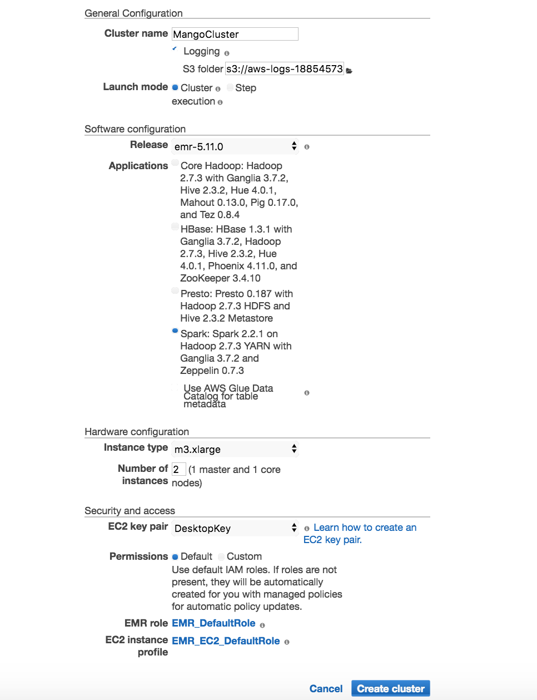
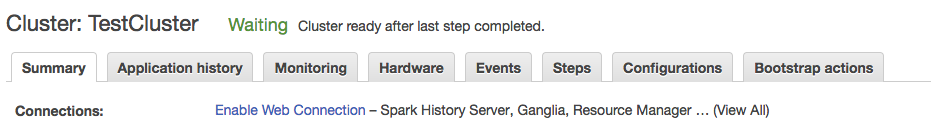

Running Mango from Amazon EMR
=============================

Amazon EMR provides a pre-built Hadoop and Spark distribution that allows users to easily deploy and test Mango.

Before you start
----------------

`Set up an EC2 key pair <https://docs.aws.amazon.com/AWSEC2/latest/UserGuide/ec2-key-pairs.html#having-ec2-create-your-key-pair>`__.

You will also need to install the AWS cli to ssh into your machines:

1. `Install the AWS cli <https://docs.aws.amazon.com/cli/latest/userguide/installing.html>`__
2. `Configure the AWS cli <https://docs.aws.amazon.com/cli/latest/userguide/cli-chap-getting-started.html>`__

Create a cluster
----------------

Navigate to the EMR console in a browser and click "Create Cluster".

In the resulting pop up, configure the following items:

1. Name the cluster
2. Choose Applications for **Spark: Spark 2.2.1 on Hadoop 2.7.3 YARN with Ganglia 3.7.2 and Zeppelin 0.7.3**
3. Choose the number of instances you will need
4. Select your EC2 key pair that you will use to ssh into the cluster

Click "Create Cluster".
This will take a couple minutes to start. Once the status registers as "Waiting", you can access an monitor your EMR cluster in the aws console.

Enabling Web Connection
-----------------------
To view the Spark UI, notebook, and browser, you must setup a web connection for the cluster. To do so, navigate to your Amazon EMR Page and click on **Enable Web Connection** and follow these instructions.

Note that for accessing the recommended 8157 port for FoxyProxy (as well as port 22 for ssh), you will have to expose these ports in the security group for the master node. <TODO instructions>

To do this, navigate to **Security and access** in your Cluster EMR manager. Click on **Security groups for Master**. Add a new rule for ssh port 22 or the port configured in FoxyProxy) to inbound to <YOUR_PUBLIC_IP_ADDRESS>/32.
<TODO image here>

Accessing Applications
----------------------
This section explains how to ssh into the cluster and view UI application in the web browser.

Connect to cluster via ssh
--------------------------
To ssh into your cluster, navigate to your EMR cluster in AWS console and click on 'ssh'. This will give you the command you need to ssh into the cluster.

Accessing Web UI'
-----------------

.. code:: bash

 ssh -i ~/.ssh/DesktopKey.pem -ND <PORT_NUM> hadoop@<PUBLIC_MASTER_DNS>

Where <PORT_NUM> is the configured port in FoxyProxy, and hadoop@<PUBLIC_MASTER_DNS> is the address you use
to ssh into the master cluster node. Let this run throughout your session.

Testing your Configuration
--------------------------

You should now be able to access the Hadoop UI.
The Hadoop UI is located at:

.. code:: bash

<PUBLIC_MASTER_DNS>:8088

You can access Spark applications through this UI when they are running.

Configuring Mango
------------------

To setup Mango, download the install script to configure Docker with Mango:

.. code:: bash

  # Download the file
  # TODO: change this to master
  wget https://raw.githubusercontent.com/akmorrow13/mango/aws-documentation/bin/emr/install.sh
  chmod u+x install.sh
  ./install.sh

Running Mango Browser on EMR
-------------------------------

.. code:: bash

  # Download the file
  # TODO: change this to master
  wget https://raw.githubusercontent.com/akmorrow13/mango/aws-documentation/bin/emr/run-browser.sh
  chmod u+x run-browser.sh
  # Run the Browser
  ./run-browser.sh <SPARK_ARGS> -- <MANGO_ARGS>

TODO: input for Spark and Mango (required)
TODO: example cmd with s3

Note: The first time it may take a while to set up.

Navigate to <PUBLIC_MASTER_DNS>:8080 to access the browser.

Running Mango Notebook on EMR
--------------------------------

.. code:: bash

  # Download the file
  # TODO: change this to master
  wget https://raw.githubusercontent.com/akmorrow13/mango/aws-documentation/bin/emr/run-notebook.sh
  chmod u+x run-notebook.sh
  # Run the Notebook
  ./run-notebook.sh <SPARK_ARGS> -- <NOTEBOOK_ARGS>

Note: It will take a couple minutes on startup for the Docker configuration to complete.

# TODO discuss inputs

# TODO example notebook

Navigate to <PUBLIC_MASTER_DNS>:8888 to access the notebook. Type in the Jupyter notebook token provided in the terminal.

Accessing files from HDFS
-------------------------------
Mango notebook and Mango browser can also access files from hdfs on EMR. To do so, first put the files in hdfs:

.. code:: bash

  hdfs dfs -put <my_file.bam>

You can then reference the file through the following code in Mango notebook:

.. code:: bash

  ac.loadAlignments('hdfs:///users/hadoop/<my_file.bam>')
