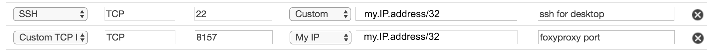
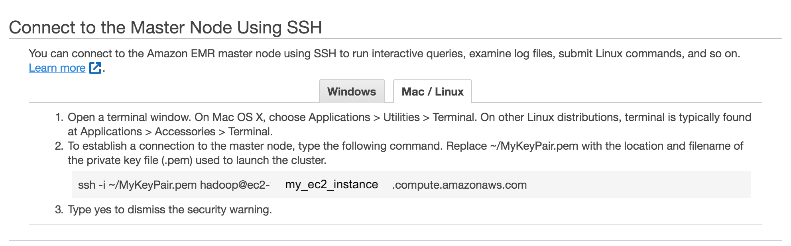

Running Mango from Amazon EMR
=============================

`Amazon Elatic Map Reduce (EMR) <https://aws.amazon.com/emr/>`__ provides pre-built Hadoop and Spark distributions which allows users to easily deploy and run Mango.
This documentation explains how to configure requirements to connect with AWS on your local machine, and how to run Mango
on AWS.

Before you Start
----------------

You will first need to set up an EC2 key pair and configure the AWS Command Line Interface (AWS CLI) using your key.
This will allow you to create clusters and ssh into your machine from the command line.

First, follow the following configuration steps:

1. `Set up an EC2 key pair <https://docs.aws.amazon.com/AWSEC2/latest/UserGuide/ec2-key-pairs.html#having-ec2-create-your-key-pair>`__.
   This keypair allows you to securely access instances on AWS using a private key.
2. `Install the AWS CLI <https://docs.aws.amazon.com/cli/latest/userguide/installing.html>`__
3. `Configure the AWS CLI <https://docs.aws.amazon.com/cli/latest/userguide/cli-chap-getting-started.html>`__

This will allow you to access AWS using your credentials.

Running Mango through Docker
============================

This section explains how to run the Mango browser and the Mango notebook through `Docker <https://www.docker.com/>`__ on Amazon EMR.
Using Docker allows users to quickly get Mango up and running without needing to configure different environment variables on
their cluster. If you need more flexibility in configuration, see Running Mango standalone_.

Creating a Cluster
------------------

First, you must configure an EMR cluster. This can be done using the `AWS CLI <https://docs.aws.amazon.com/cli/latest/userguide/installing.html>`__.

Through the command line, create a new cluster:

.. code:: bash

  aws emr create-cluster
  --release-label emr-5.27.0 \
  --name 'emr-5.27.0 Mango example' \
  --applications Name=Hadoop Name=Hive Name=Spark  \
  --ec2-attributes KeyName=<YOUR_EC2_KEY>,InstanceProfile=EMR_EC2_DefaultRole \
  --service-role EMR_DefaultRole \
  --instance-groups \
    InstanceGroupType=MASTER,InstanceCount=1,InstanceType=c3.4xlarge \
    InstanceGroupType=CORE,InstanceCount=4,InstanceType=c3.4xlarge \
  --region <your_region> \
  --log-uri s3://<your-s3-bucket>/emr-logs/ \
  --bootstrap-actions \
  Name='Install Mango', Path="s3://bdg-mango/install-bdg-mango-docker-emr5.sh"

In the code chunk above, set your EC2 key pair name:

.. code:: bash

    --ec2-attributes KeyName=<YOUR_EC2_KEY>

Note the instance counts:

.. code:: bash

    InstanceGroupType=CORE,InstanceCount=4,InstanceType=c3.4xlarge

In this example, we have set the number of instance counts, or the number of workers, to 4. If you are using larger or
smaller workloads, you should scale this number up or down accordingly. Note that more instances will cost more money.

The bootstrap action:

.. code:: bash

  --bootstrap-actions \
  Name='Install Mango', Path="s3://bdg-mango/install-bdg-mango-docker-emr5.sh"

will download docker and required scripts. These scripts will be available on your EMR master node in the directory ``/home/hadoop/mango-scripts``.

Enabling a Web Connection
--------------------------
To view the Spark UI, notebook, and browser, you must setup a web connection for the cluster. To do so, navigate to your Amazon EMR
Clusters page, click your started cluster, and click on **Enable Web Connection** and follow the instructions for enabling a connection.

.. image:: ../img/EMR/enable_web_connection.png

These instructions will require you to install the `FoxyProxy <https://getfoxyproxy.org/>`__ addon in your web browser.
Note that for accessing the recommended 8157 port using FoxyProxy (as well as port 22 for ssh), you will have to
`expose these ports <https://docs.aws.amazon.com/AWSEC2/latest/UserGuide/authorizing-access-to-an-instance.html>`__
in the security group for the master node.

To expose required ports on the master node, navigate to **Security and access** in your Cluster EMR manager. Click on **Security groups for Master**. Add a inbound new rule for ssh port 22 and a new TCP rule for
the port configured in FoxyProxy inbound to <YOUR_PUBLIC_IP_ADDRESS>/32.

Connecting to Cluster
---------------------

To ssh into your cluster, navigate to your EMR cluster in AWS console and click on ``ssh``. This will give you the command
you need to `ssh into the cluster <https://aws.amazon.com/premiumsupport/knowledge-center/ec2-linux-ssh-troubleshooting/>`__.

Accessing the Web UI
--------------------

Click on **Enable Web Connection** in the AWS cluster console and run the ssh command for accessing the UIs through your browser.
The command line argument will look like this:

.. code:: bash

 ssh -i ~/MyKey.pem -ND <PORT_NUM> hadoop@<PUBLIC_MASTER_DNS>

Where <PORT_NUM> is the configured port in FoxyProxy (default is 8157), and hadoop@<PUBLIC_MASTER_DNS> is the address you use
to ssh into the master cluster node. Let this run throughout your session.

Testing your Configuration
--------------------------

You should now be able to access the Hadoop UI.
The Hadoop UI is located at:

.. code:: bash

  <PUBLIC_MASTER_DNS>:8088

You can access Spark applications through this UI when they are running.

Running the Mango Browser on EMR with Docker
--------------------------------------------

To run Mango Browser on EMR on top of Docker with the hg19 genome run:

.. code:: bash

  GENOME_BUILD_FILE=<path_to_genome_file> # ie hg18.genome, hg19.genome, mm10.genome, etc.

  /home/hadoop/mango-scripts/run-browser-docker.sh <SPARK_ARGS> -- $GENOME_BUILD_FILE \
    -reads s3a://1000genomes/phase1/data/NA19685/exome_alignment/NA19685.mapped.illumina.mosaik.MXL.exome.20110411.bam

**Note** You must first create a GENOME_BUILD_FILE. To do so, see `creating a reference genome in docker <#creating-a-reference-genome-on-emr-with-docker>`__.

Navigate to <PUBLIC_MASTER_DNS>:8081 to access the browser. In the browser, navigate to ``TP53, chr17-chr17:7,510,400-7,533,590`` to view exome data.

Creating a reference genome on EMR with Docker
----------------------------------------------

To run the Mango browser, you must first create a reference genome. For example, to
create an hg18 genome, run:

.. code:: bash

    /home/hadoop/mango-scripts/make-genome-docker.sh hg18 <output_directory>

This script will create a ``.genome`` file and save it to <output_directory> on the master host.

You can then run the Mango browser using your new genome:

.. code:: bash

    /home/hadoop/mango-scripts/run-browser-docker.sh <SPARK_ARGS> -- <output_directory>/hg18.genome

The ``run-browser-docker.sh`` script mounts the location of your new genome file, making it accessible to the docker container.

**Note**: s3a latency slows down Mango browser. For interactive queries, you can first `transfer s3a files to HDFS <https://docs.aws.amazon.com/emr/latest/ReleaseGuide/UsingEMR_s3distcp.html>`__.

You can then run the Mango browser on HDFS files:

.. code:: bash

  /home/hadoop/mango-scripts/run-browser-docker.sh <SPARK_ARGS> -- <path_to_genome_file>/hg19.genome \
    -reads hdfs:///user/hadoop/NA19685.mapped.illumina.mosaik.MXL.exome.20110411.bam

**Note**: The first time Docker may take a while to set up.

Running Mango Notebook on EMR with Docker
-----------------------------------------

To run the Mango Notebook on EMR on top of Docker, run the ``run-notebook-docker`` script:

.. code:: bash

  # Run the Notebook
  /home/hadoop/mango-scripts/run-notebook-docker.sh <SPARK_ARGS> -- <NOTEBOOK_ARGS>

Where <SPARK_ARGS> are Spark specific arguments and <NOTEBOOK_ARGS> are Jupyter notebook specific arguments.
Example Spark arguments are shown in the following example:

.. code:: bash

  ./run-notebook.sh --master yarn --num-executors 64 --executor-memory 30g --

**Note**: It will take a couple minutes on startup for the Docker configuration to complete.

Navigate to <PUBLIC_MASTER_DNS>:8888 to access the notebook. Type in the Jupyter notebook token provided in the terminal.
An example notebook for EMR can be found `on the Mango GitHub <https://github.com/bigdatagenomics/mango/blob/master/example-files/notebooks/aws-1000genomes.ipynb>`__.

Accessing files in the Mango notebook from HDFS
-----------------------------------------------
Mango notebook and Mango browser can also access files from HDFS on EMR. To do so, first put the files in HDFS:

.. code:: bash

  hdfs dfs -put <my_file.bam>

You can then reference the file through the following code in Mango notebook:

.. code:: bash

  ac.loadAlignments('hdfs:///user/hadoop/<my_file.bam>')

.. _standalone:

Running Mango Standalone
========================

This section explains how to run the Mango browser and the Mango notebook without Docker on EMR.

Creating a Cluster
------------------

Through the AWS command line, create a new cluster with the latest Mango version:

.. code:: bash

  aws emr create-cluster
  --release-label emr-5.27.0 \
  --name 'emr-5.27.0 Mango example' \
  --applications Name=Hadoop Name=Hive Name=Spark Name=JupyterHub  \
  --ec2-attributes KeyName=<YOUR_EC2_KEY>,InstanceProfile=EMR_EC2_DefaultRole \
  --service-role EMR_DefaultRole \
  --instance-groups \
    InstanceGroupType=MASTER,InstanceCount=1,InstanceType=c3.4xlarge \
    InstanceGroupType=CORE,InstanceCount=4,InstanceType=c3.4xlarge \
  --region <your_region> \
  --log-uri s3://<your-s3-bucket>/emr-logs/ \
  --bootstrap-actions \
  Name='Install Mango', Path="s3://bdg-mango/install-bdg-mango-dist-emr5.sh"

Where $VERSION specifies the Mango version available in the `Maven central repository <https://search.maven.org/search?q=g:org.bdgenomics.mango>`__.

This bootstrap action will download Mango distribution code, and an example notebook file for the Mango notebook will
be available at ``/home/hadoop/mango-distribution-${VERSION}/notebooks/aws-1000genomes.ipynb``.

Finally, make sure you set your SPARK_HOME env:

.. code:: bash

  export SPARK_HOME=/usr/lib/spark

Running Mango Browser on EMR
----------------------------

To run Mango Browser on EMR on top of Docker, you will first need to configure a reference. To create a reference, see
`Building a Genome <../browser/genomes.html>`__.

Simply run:

.. code:: bash

  make_genome <GENOME_NAME> <OUTPUT_LOCATION>

This will save a file called ``<GENOME_NAME>.genome`` to your ``<OUTPUT_LOCATION>``.
Now that you have a reference, you can run Mango browser:

.. code:: bash

    /home/hadoop/mango/scripts/run-browser-emr.sh \
               --  \
                <path_to_genome>/hg19.genome \
               -reads s3a://1000genomes/phase1/data/NA19685/exome_alignment/NA19685.mapped.illumina.mosaik.MXL.exome.20110411.bam \
               -port 8080

To visualize data in the NA19685 exome, navigate to ``chr17:7,569,720-7,592,868``. Here, you will see reads surrounding TP53.

**Note**: Pulling data from s3a has high latency, and thus slows down Mango browser. For interactive queries, you can first `transfer s3a files to HDFS <https://docs.aws.amazon.com/emr/latest/ReleaseGuide/UsingEMR_s3distcp.html>`__.
The package ``net.fnothaft:jsr203-s3a:0.0.2`` used above is required for loading files from s3a. This is not required if you are only accessing data from HDFS.

If you have not `established a web connection <#enabling-a-web-connection>`__, set up an `ssh tunnel on the master node to view the browser at port 8081 <https://docs.aws.amazon.com/emr/latest/ManagementGuide/emr-ssh-tunnel-local.html>`__.

In the browser, navigate to a ``TP53, chr17:7,510,400-7,533,590`` with exome data to view results.

Running Mango Notebook on EMR
-----------------------------

To run Mango Notebook on EMR, run the mango-notebook script:

.. code:: bash

  /home/hadoop/mango/scripts/run-notebook-emr.sh \
        -- <NOTEBOOK_ARGS>

If you have `established a web connection <#enabling-a-web-connection>`__, you will now be able to access
the Mango notebook at ``<PUBLIC_MASTER_DNS>:8888``.
