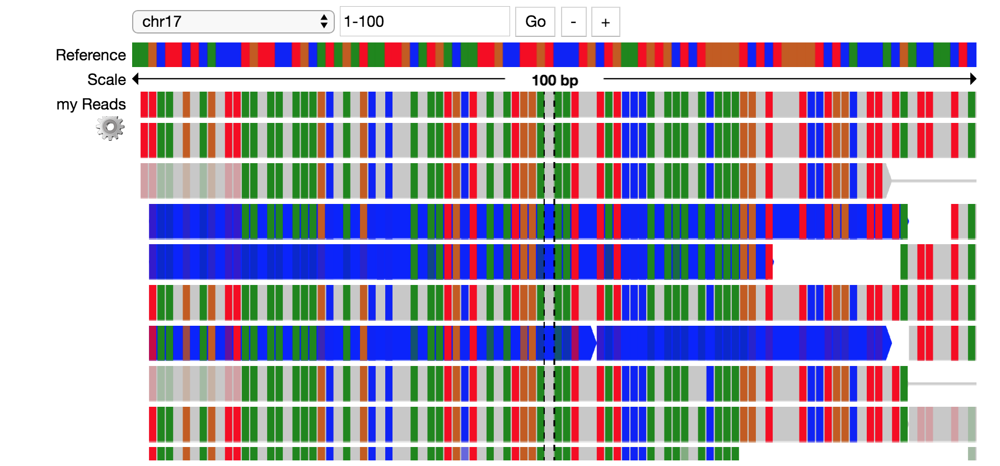
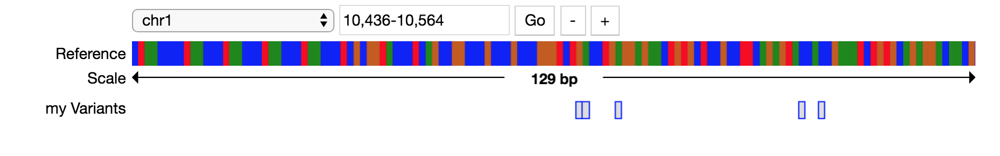
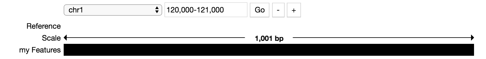
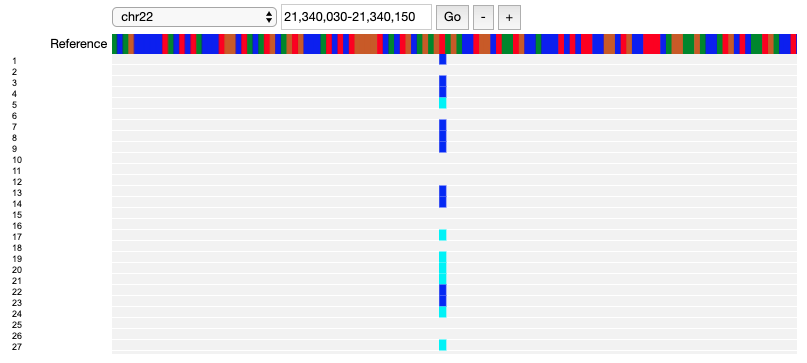

Jupyter Widget Usage
====================

**Note**: Python 2.7 is `dropping support <https://www.anaconda.com/end-of-life-eol-for-python-2-7-is-coming-are-you-ready/>`__ January 1, 2020. For this reason, Mango no longer supports Python 2.

The Mango widgets are Jupyter widgets built using `pileup.js <https://github.com/hammerlab/pileup.js>`__.
The widgets support visualizations for alignments, features,
variants, and genotypes in a Jupyter Notebook and Jupyter lab version >2.0.

Installation for Jupyter notebook
---------------------------------

First, install and enable bdgenomics.mango.pileup, a Jupyter Widget:

.. code:: bash

    pip install bdgenomics.mango.pileup

    jupyter nbextension install --py --user bdgenomics.mango.pileup
    jupyter nbextension install --py --user widgetsnbextension

    jupyter nbextension enable --py --user widgetsnbextension
    jupyter nbextension enable --py --user bdgenomics.mango.pileup

**Note**: If you are using an conda environment, install extensions using ``--sys-prefix``:

.. code:: bash

    jupyter nbextension install --py --sys-prefix bdgenomics.mango.pileup
    jupyter nbextension install --py --sys-prefix widgetsnbextension

    jupyter nbextension enable --py --sys-prefix widgetsnbextension
    jupyter nbextension enable --py --sys-prefix bdgenomics.mango.pileup

This will install the bdgenomics.mango.pileup extension into your current conda environment.

Installation for Jupyter lab
----------------------------

To use the Mango widgets in Jupyter lab, you will need the following requirements:

- `Jupyter lab version > 2.0 <https://jupyterlab.readthedocs.io/en/stable/getting_started/installation.html>`__
- `node > 12 <https://nodejs.org/en/download/>`__

.. code:: bash

    pip install bdgenomics.mango.pileup
    jupyter labextension install @jupyter-widgets/jupyterlab-manager # install the Jupyter widgets extension
    jupyter labextension install bdgenomics.mango.pileup

These tutorials show how to create a Jupyter pileup.js widget. An example notebook can be found in the `Mango Github repository <https://github.com/bigdatagenomics/mango/blob/master/mango-pileup/examples/pileup-tutorial.ipynb>`__.

Pileup Example
--------------

This example shows how to visualize alignments through a Jupyter widget.

.. code:: python

    # imports
    import bdgenomics.mango.pileup as pileup
    from bdgenomics.mango.pileup.track import *
    import pandas as pd

.. code:: python

    # read in JSON
    readsJson = pd.read_json("./data/alignments.ga4gh.chr17.1-250.json")
    GA4GHAlignmentJson = readsJson.to_json()

    # make pileup track
    tracks=[Track(viz="pileup", label="my Reads", source=pileup.sources.GA4GHAlignmentJson(GA4GHAlignmentJson))]

    # render tracks in widget
    reads = pileup.PileupViewer(chrom="chr17", start=1, stop=100, reference="hg19", tracks=tracks)
    reads

Variant Example
---------------

This example shows how to visualize variants through a Jupyter widget.

.. code:: python

    # make variant track
    tracks=[Track(viz="variants", label="my Variants", source=pileup.sources.VcfDataSource("<path_to_file>/my_vcf.vcf"))]

    # render tracks in widget
    variants = pileup.PileupViewer(chrom="chr1", start=10436, stop=10564, reference="hg19", tracks=tracks)
    variants

Feature Example
---------------

This example shows how to visualize features through a Jupyter widget.

.. code:: python

    featuresJson = pd.read_json("./data/features.ga4gh.chr1.120000-125000.json")
    GA4GHFeatureJson = featuresJson.to_json()

    # make feature track
    tracks=[Track(viz="features", label="my Features", source=pileup.sources.GA4GHFeatureJson(GA4GHFeatureJson))]

    # render tracks in widget
    features = pileup.PileupViewer(chrom="chr1", start=120000, stop=121000, reference="hg19", tracks=tracks)
    features

Genotype Example
----------------

This example shows how to visualize genotypes through a Jupyter widget.

.. code:: python

    # make genotype track
    tracks=[Track(viz="genotypes", label="my Genotypes", source=pileup.sources.VcfDataSource("<path_to_file>/my_vcf.vcf"))]

    # render tracks in widget
    genotypes = pileup.PileupViewer(chrom="chr22", start=21340030, stop=21340150, reference="hg19", tracks=tracks)
    genotypes

