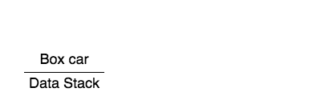

[](https://travis-ci.org/hammerlab/data-canvas) [](https://coveralls.io/github/hammerlab/data-canvas?branch=master)[](https://gitter.im/hammerlab/data-canvas?utm_source=badge&utm_medium=badge&utm_campaign=pr-badge)
data-canvas
===========

data-canvas allows you to add event tracking and tests to existing [canvas][1]
code without sacrificing performance and without forcing you to refactor.

It does this by introducing a new abstraction to canvas: the data stack. 

Background
----------

The [HTML5 canvas][1] has several advantages over [SVG][], its main rival for
graphics on the web:

- Depending on the benchmark, it's anywhere from 10x to 300x faster than SVG.
- It allows for a simpler coding style. Rather than setting up [elaborate data
  binding][2] to track updates, you just redraw the scene from scratch every
  time.

That being said, canvas also has some major drawbacks:

- It can only be used through JavaScript. Rather than styling elements
  declaratively using CSS, you have to style them in code.
- It's harder to work with events. For example, when the user clicks on the
  canvas, it's difficult to determine exactly which element they clicked on.
- It's harder to test. Assertions about individual pixels are hard to
  understand and can break easily. With SVG, you can find complete shapes using
  selectors and make assertions about them.

data-canvas aims to overcome some of these drawbacks without compromising
canvas's speed and simplicity.

A canvas example
----------------

Here's a bit of data representing a car:

```javascript
var car = {
  name: 'Box car',
  x: 100,
  y: 100,
  width: 200,
  wheels: [
    {name: 'back wheel', x: 20, radius: 15},
    {name: 'front wheel', x: 180, radius: 10}
  ]
};
```

You might render it using canvas like so:

```javascript
function renderScene(ctx, car) {
  ctx.fillStyle = 'red';
  ctx.fillRect(car.x, car.y, car.width, -25);
  ctx.fillRect(car.x + 50, car.y - 25, car.width - 100, -25);
  ctx.fillStyle = 'black';
  ctx.strokeStyle = 'gray';
  car.wheels.forEach(function(wheel) {
    ctx.beginPath();
    ctx.arc(car.x + wheel.x, car.y, wheel.radius, 0, Math.PI*2, true);
    ctx.fill();
    ctx.stroke();
  });
}

function renderBoxyCar() {
  var ctx = canvas.getContext('2d');
  renderScene(ctx, car);
}
```


_(see [full demo][4])_

This is a beautiful car and a faithful rendering of the data. But what if you
wanted to add a click handler to it? What if you wanted to write a test which
asserted that there were two wheels?

data-canvas can help you do both of these.

The data stack
--------------
[_"All problems in computer science can be solved by another level of indirection."_][3]

data-canvas wraps the browser's canvas rendering context with a `DataContext`,
which adds two new primitives:

```
declare class DataCanvasRenderingContext2D extends CanvasRenderingContext2D {
  pushObject(o: any): void;
  popObject(): void;
}
```

These primitives associate a _data stack_ with the canvas rendering context.
Whenever you render a bit of data, you should push it onto the data stack. When
you're done with it, you pop it off.

Here's what the car example looks like using a `DataContext`:

```javascript
function renderScene(ctx) {
  ctx.pushObject(car);  // <---
  ctx.fillStyle = 'red';
  ctx.fillRect(car.x, car.y, car.width, -25);
  ctx.fillRect(car.x + 50, car.y - 25, car.width - 100, -25);
  ctx.fillStyle = 'black';
  ctx.strokeStyle = 'gray';
  car.wheels.forEach(function(wheel) {
    ctx.pushObject(wheel);  // <---
    ctx.beginPath();
    ctx.arc(car.x + wheel.x, car.y, wheel.radius, 0, Math.PI*2, true);
    ctx.fill();
    ctx.stroke();
    ctx.popObject();  // <---
  });
  ctx.popObject();  // <---
}

function renderBoxyCar() {
  var ctx = dataCanvas.getDataContext(canvas.getContext('2d'));   // <---
  renderScene(ctx);
}
```

The new code is marked by comments. The `pushObject`/`popObject` calls fit
nicely into the existing code without changing its style.

Here's what the data stack looks like while the rendering happens:

<!--
Code for generating this image is here: http://jsfiddle.net/7nkbfbkb/6/
convert -background white -alpha remove -layers OptimizePlus -delay 75 -dispose Background -loop 0 frame*.png data-canvas-stack.gif
-->


Testing
-------
Using this modified code, we can write a test:

```javascript
describe('boxy car', function() {
  it('should have two wheels', function() {
    var RecordingContext = dataCanvas.RecordingContext;
    RecordingContext.recordAll();  // stub in a recording data context
    renderBoxyCar();

    var wheels = RecordingContext.drawnObjectsWith(x => x.radius);
    expect(wheels).to.have.length(2);
    expect(wheels[0].name).to.equal('back wheel');
    expect(wheels[1].name).to.equal('front wheel');

    RecordingContext.reset();  // restore the usual data context
  });
});
```

The `RecordingContext.recordAll()` call swaps in an alternate implementation of
`DataContext` which records every method called on it. This includes the
`pushObject` calls. After the drawing is done, we can access the drawn objects
using its helper methods, such as `drawnObjectsWith`.

It's typically easiest to make assertions about the objects pushed onto the
data stack, but you can make assertions about the underlying drawing commands, too:

```javascript
describe('boxy car', function() {
  it('should draw two wheels', function() {
    var RecordingContext = dataCanvas.RecordingContext;
    RecordingContext.recordAll();  // stub in a recording data context
    renderBoxyCar();
    RecordingContext.reset();  // restore the usual data context

    var wheels = RecordingContext.callsOf('arc');
    expect(wheels).to.have.length(2);
    expect(wheels[0].slice(0, 3)).to.deep.equal(['arc', 120, 100, 15]);
    expect(wheels[1].slice(0, 3)).to.deep.equal(['arc', 280, 100, 10]);
  });
});
```

Writing the test required no modifications to the rendering code beyond the
`pushObject`/`popObject` calls.


Click tracking
--------------

data-canvas also facilitates mapping (x, y) coordinates to objects in the scene.

Suppose you wanted to add click handlers to the wheels and the car itself.
Here's how you might do that:

```javascript
canvas.onclick = function(e) {
  var ctx = canvas.getContext('2d');
  var trackingContext = new dataCanvas.ClickTrackingContext(ctx, e.offsetX, e.offsetY);
  renderScene(trackingContext);

  if (trackingContext.hit) {
    alert(trackingContext.hit[0].name);
  }
};
```
_(Try it with [this fiddle][5])_

Again, no modifications to the scene rendering code were required. To determine
which object (if any) was clicked on, we swapped in an alternate data context
(`ClickTrackingContext`) and redrew the scene.

While redrawing the scene may feel inefficient, it rarely is.
`ClickTrackingContext` doesn't need to draw any shapes, only check whether they
contain the relevant point.

After rendering the scene, `ClickTrackingContext` will have both a `hit` and a
`hits` property. `hit` records the contents of the data stack for the last
(top-most) shape which contains the point. `hits` records the contents for all
shapes which contained the point, ordered from top to bottom.

For example, if you click the top part of the back wheel, then we'll have:

`hit = [back wheel, car]`

Because both the car and the back wheel were on the data stack when the car was drawn.

We'll also have:

`hits = [[back wheel, car], [car]]`

This is because only `car` was on the stack when the car rectangle was drawn,
and another shape (the wheel) was drawn on top of it.


Usage
-----

To install data-canvas, use NPM:

    npm install data-canvas

Then include it either in your page:

    <script src="node_modules/data-canvas/data-canvas.js"></script>

or require it:

    var dataCanvas = require('data-canvas');

data-canvas comes with type bindings for [Flow][]. To use these, add the
following to your `.flowconfig`:

```
[ignore]
.*node_modules/data-canvas.*

[lib]
node_modules/data-canvas/flowtype
```


[1]: https://developer.mozilla.org/en-US/docs/Web/API/Canvas_API
[svg]: https://developer.mozilla.org/en-US/docs/Web/SVG
[2]: http://alignedleft.com/tutorials/d3/binding-data/
[3]: http://www.dmst.aueb.gr/dds/pubs/inbook/beautiful_code/html/Spi07g.html
[4]: http://jsfiddle.net/7nkbfbkb/1/
[5]: http://jsfiddle.net/7nkbfbkb/3/
[flow]: http://flowtype.org
